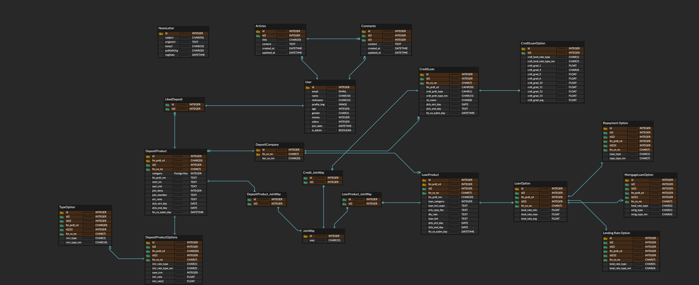
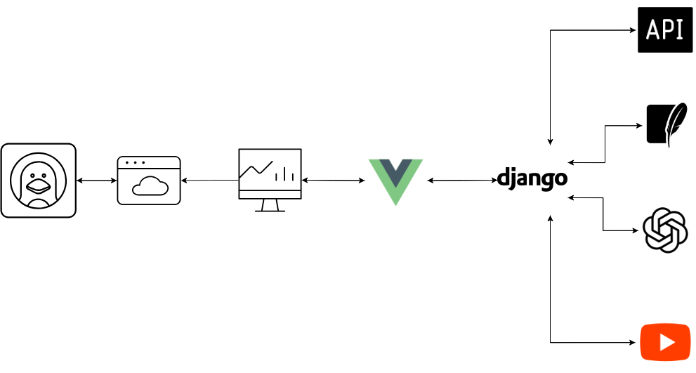

README.md

# MergeBank

[](https://developer.mozilla.org/docs/Web/JavaScript)
[](https://vuejs.org/)
[](https://vitejs.dev/)
[](https://www.python.org/)
[](https://www.djangoproject.com/)

[](https://github.com/)
[](https://gitlab.com/)
[](https://figma.com/)
[](https://www.notion.so/)

개인 금융 관리 및 금융 상품 추천 서비스를 제공하는 웹 애플리케이션입니다.

## 프로젝트 개요

본 프로젝트는 사용자별 맞춤형 금융 상품 추천과 금융 관련 학습 콘텐츠를 제공하는 종합 금융 플랫폼입니다. 사용자의 재정 상황과 목표에 따라 최적의 금융 상품(예금, 적금, 대출)을 추천하고, 금융 교육 콘텐츠를 통해 금융 지식을 향상시키는 기회를 제공합니다.

## 프로젝트 기간
2025.05.22 ~ 2025.05.28

## 팀원 및 역할

<table style="text-align:center; width:60%">
   <tr>
      <td></td>
      <td></td>   
   </tr>
   <tr>
      <td>팀장&nbsp;&nbsp;&nbsp;<a href="https://github.com/ryongseong">임성룡</a>&nbsp;&nbsp;<b>FE,BE</b></td>
      <td>팀원&nbsp;&nbsp;&nbsp;<a href="https://github.com/lee-gi-tae">이기태</a>&nbsp;&nbsp;<b>FE,BE</b></td>
   </tr>
    <tr>
      <td style="word-break: keep-all">DB설계, 프로젝트 초기세팅, 인증/인가, 메인페이지, 마이페이지, 게시판</td>
      <td style="word-break: keep-all">UI설계, 상품비교, 메인페이지, 은행 지점검색, 게시판</td>
   </tr>
</table>

## 주요 기능

### 1. 계정 관리
- 회원가입/로그인 (소셜 로그인 지원: Google, Kakao)
- 사용자 프로필 관리 및 개인정보 설정
- 재정 상황(소득, 자산 등) 등록 및 관리

### 2. 금융 상품 관리
- 다양한 금융 상품 정보 조회 (예금, 적금, 대출)
- 사용자 맞춤형 금융 상품 추천
- 금융 상품별 상세 정보 및 비교 기능

### 3. 커뮤니티 기능
- 금융 관련 게시글 작성 및 공유
- 댓글 및 좋아요 기능으로 소통
- 인기 게시글 추천

### 4. 금융 교육 콘텐츠
- YouTube를 통한 금융 관련 교육 동영상 제공
- 관심 동영상 저장 및 노트 기능
- 맞춤형 금융 교육 콘텐츠 추천

### 5. AI 서비스
- 금융 상담 서비스 (OpenAI API 활용)
- 금융 상품 분석 및 개인화된 추천
   - 사용자의 자산과 월급에 따라 다르게 추천하며 예상 수익금 반환

## 기술 스택

### 백엔드
- **언어 및 프레임워크**: Python, Django, Django REST Framework
- **인증**: JWT, Django REST Auth
- **데이터베이스**: SQLite
- **API 문서화**: drf-spectacular
- **외부 API**: 금융상품 API, YouTube Data API, OpenAI API

### 프론트엔드
- **프레임워크**: Vue.js 3, Pinia (상태 관리)
- **UI/UX**: Bootstrap 5, FontAwesome
- **차트 및 시각화**: Chart.js
- **국제화**: Vue-i18n
- **HTTP 클라이언트**: Axios
- **빌드 도구**: Vite

## 환경 설정

### 필수 요구사항
- Python 3.9+
- Node.js 22+
- npm 9+

### 백엔드 설정

```bash
# 백엔드 폴더로 이동
cd backend

# 가상환경 생성 및 활성화
python -m venv venv
source venv/bin/activate  # Windows: venv\Scripts\activate

# 의존성 설치
pip install -r requirements.txt

# 환경 변수 설정 (.env 파일 생성)
# FINANCE_API=
# EXCHANGE_RATE_API=
# DEPOSIT_PRODUCT_API=
# GOOGLE_CLIENT_ID=
# GOOGLE_CLIENT_SECRET=
# KAKAO_CLIENT_ID=
# OPENAI_API_KEY=
# YOUTUBE_API=

# 데이터베이스 마이그레이션
python manage.py migrate

# 서버 실행
python manage.py runserver
```

### 프론트엔드 설정

```bash
# 프론트엔드 폴더로 이동
cd frontend

# 의존성 설치
npm install

# 환경 변수 설정 (.env 파일 생성)
# VITE_KAKAO_API=
# VITE_KAKAO_CLIENT_ID=
# VITE_GOOGLE_CLIENT_ID=
# VITE_GOOGLE_CLIENT_SECRET=

# 개발 서버 실행
npm run dev
```

## API 명세

### 계정 API
- `POST /accounts/register/` - 회원가입
- `POST /accounts/login/` - 로그인
- `GET /accounts/profile/` - 사용자 프로필 조회
- `PUT /accounts/profile/` - 프로필 업데이트
- `POST /accounts/google/login/` - Google 소셜 로그인
- `POST /accounts/kakao/login/` - Kakao 소셜 로그인

### 금융상품 API
- `GET /products/deposit/` - 예금 상품 목록 조회
- `GET /products/saving/` - 적금 상품 목록 조회
- `GET /products/loan/` - 대출 상품 목록 조회
- `GET /products/recommend/` - 맞춤형 상품 추천

### 커뮤니티 API
- `GET /articles/` - 게시글 목록 조회
- `POST /articles/` - 게시글 작성
- `GET /articles/<id>/` - 게시글 상세 조회
- `PUT /articles/<id>/` - 게시글 수정
- `DELETE /articles/<id>/` - 게시글 삭제
- `POST /articles/<id>/like/` - 게시글 좋아요 토글
- `GET /articles/<id>/comments/` - 댓글 목록 조회
- `POST /articles/<id>/comments/` - 댓글 작성

### YouTube API
- `GET /youtube/videos/search/?q=query` - YouTube 영상 검색
- `GET /youtube/saved/` - 저장된 영상 목록 조회
- `POST /youtube/saved/` - 영상 저장
- `PATCH /youtube/saved/<id>/` - 저장된 영상 노트 수정
- `DELETE /youtube/saved/<id>/` - 저장된 영상 삭제

## 프로젝트 구조

```
Final-PJT/
├── backend/
│   ├── accounts/       - 사용자 계정 관리
│   ├── articles/       - 커뮤니티 게시글 관리
│   ├── products/       - 금융 상품 관리
│   ├── youtube/        - YouTube 영상 관리
│   ├── final_pjt/      - 프로젝트 설정
│   ├── media/          - 미디어 파일 저장
│   └── requirements.txt
├── frontend/
│   ├── public/
│   ├── src/
│   │   ├── assets/     - 정적 파일
│   │   ├── components/ - Vue 컴포넌트
│   │   ├── router/     - Vue Router 설정
│   │   ├── services/   - API 서비스
│   │   ├── stores/     - Pinia 스토어
│   │   ├── utils/      - 유틸리티 함수
│   │   ├── views/      - 페이지 뷰
│   │   ├── App.vue     - 루트 컴포넌트
│   │   └── main.js     - 진입점
│   ├── package.json
│   └── vite.config.js
├── ERD.png           - 데이터베이스 구조도
├── architecture.png  - 아키텍처 설계도
└── README.md         - 프로젝트 문서
```

## ERD


## 아키텍처 설계


## 느낀점 및 후기
이번 MergeBank 프로젝트는 단순한 기능 구현을 넘어서, 사용자 중심의 서비스 설계와 실제 금융 데이터를 활용한 추천 시스템 구축이라는 점에서 매우 실무적인 경험을 제공해주었습니다. 특히 다음과 같은 부분에서 많은 인사이트와 성장을 느낄 수 있었습니다.

### 요구사항 기반 개발 역량 향상
사전에 주어진 요구사항 문서를 바탕으로 핵심 기능을 분석하고, 이를 바탕으로 전체 프로젝트의 흐름과 구조를 설계하였습니다. 덕분에 기능 구현 시 혼선 없이 체계적으로 개발을 진행할 수 있었으며, 요구사항 기반 개발의 중요성을 체감할 수 있었습니다

### 팀 협업 및 역할 분담의 중요성
2인 팀으로 진행되었기에 모든 기능을 균형 있게 분담하며, 효율적인 커뮤니케이션을 통해 문제를 빠르게 해결해 나갔습니다. 특히 각자의 강점을 살려 FE/BE를 유기적으로 나누어 진행했던 점이 프로젝트 완성도 향상에 크게 기여했습니다.

### 기술적 도전과 확장성 고민
지도 기반 은행 검색(Kakao Map), YouTube 영상 검색 및 저장 기능, 금융 상품 추천 알고리즘 구현 등 다양한 외부 API와 라이브러리를 활용하면서 기술적 난이도도 높았지만, 그만큼 폭넓은 경험을 쌓을 수 있었습니다. 향후 더 많은 데이터와 AI 기술을 접목해 확장 가능한 플랫폼으로 발전시켜 보고 싶다는 생각도 들었습니다.
